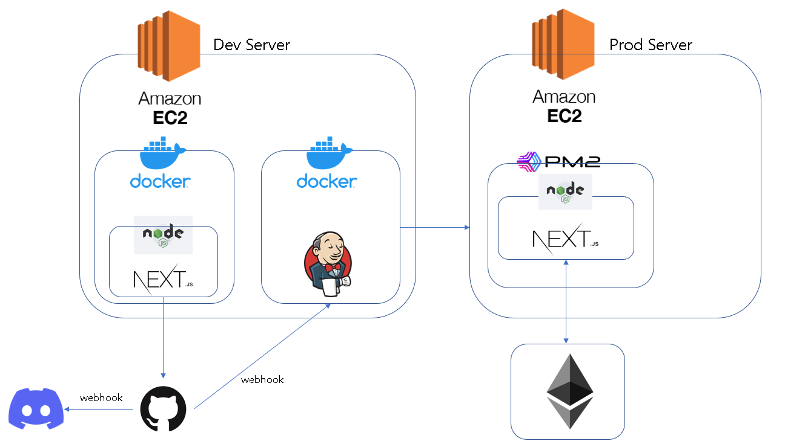

# Fantom Sloth

### Introduction

Amidst a crypto market that is experiencing a period of turbulence, our team endeavored to develop a unique solution that distinguishes itself from conventional practices. While many de-fi protocols and NFT projects are making speculative claims, our focus is on elevating the industry's standards in a positive direction. We proudly present "Sloths on the Run," a platform that offers reliable stability through the implementation of stable NFTs. Additionally, our solution incorporates an interactive system that enables users to verify the authenticity of their sNFTs.

Sloths on the Run is a Stable-NFT (sNFT) project on Fantom Network. Essentially, each sNFT represents a Sloth that's done some pretty shady stuff in the Fantom world - rug-pulls, hacking, you name it. Here's the twist: you can jailbreak any Sloth you want for a certain amount of money, then decide whether to keep him locked up or turn him in for a sweet bounty, which is the price for minting. In a crypto market that's going through a rough patch, we wanted to create something that goes against the grain. While other de-fi protocols and NFT projects make wild promises, we're all about changing the game for the better.

### How It Works

The core idea is very simple. You can mint an sNFT on Fantom Network just like how you can mint any other NFT. Let’s say you minted a Sloth for $10,000. Minting means you will ‘jailbreak’ the Sloth from prison. You can use the Sloth as a present to a friend, as a payment to your colleague, or simply just as a way to show off on Twitter. Don’t ever worry about the price falling. 

Additionally, each Sloth has an encrypted invisible watermark. Anyone with Sloths mobile application can scan the Sloth, and the scanning will return the information about the Sloth. As it works even when printed, it also shows the possibility of the world’s first paper crypto! 

Just like how sloths are the most stable and non-moving animals on the planet, the price of the Sloth sNFT is guaranteed by protocol. If you are feeling guilty or need some cash at the moment, feel free to bring the Sloth sNFT back to the protocol and redeem your $10,000. 

### Why Fantom?

We decided to build Sloths on the Run on the Fantom Network for several specific reasons. Firstly, we were drawn to the Lachesis consensus mechanism that Fantom uses, as it is designed for high performance and low latency. We knew that if we wanted to create a real-time gaming experience for our users, we needed a blockchain platform that could handle high transaction throughput without sacrificing speed or efficiency.

Additionally, we appreciated the fast finality that Fantom provides. Knowing that once a block is confirmed, the transactions within it are considered final, gave us peace of mind when it comes to ensuring the accuracy and validity of in-game transactions.

Another feature of the Fantom Network that attracted us was its support for cross-chain interoperability. We knew that we wanted to create an NFT project that could interact with other blockchain networks and exchange assets between them. The ability to communicate with other blockchain ecosystems would help to enhance the functionality and utility of our project, which would ultimately benefit our users.

Overall, we felt that the unique traits of the Fantom made it the ideal choice for building Sloths on the Run. We believe that Fantom will provide our users with a seamless and enjoyable gaming experience, while also ensuring the security and scalability of our project.

### Roadmap: What’s Next?

Our vision is to launch a protocol on Fantom Network. Of course, in crypto, there needs to be a profit model. The protocol will first earn a commission from minting, redeeming, and sending sNFTs. The commission gets distributed back to the holders in a decentralized manner every certain fixed time, such as a week. 

We wanted to fix the problem in conventional De-Fi 2.0 protocols that only early on-boarders make a profit while the ones who come in late lose everything. In our sNFT protocol, the interest an investor receives will depend on how much the total value of his sNFTs holds in the whole protocol pool, not when he comes in. 

In short, if the protocol’s TVL is $10M and you have $1M sNFT, you will be receiving 10% of the shared interest. If there was not a single transaction in the protocol during the week, then no interest for everyone. No complication, no scam. Furthermore, this means that the time entering the protocol has no effect whatsoever on the investor, and in fact, the last man standing will be the one to earn the biggest interest, since there will be massive interest from redemption commission!